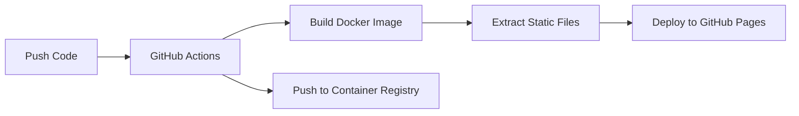

# 🚀 Docker + GitHub Actions + GitHub Pages Deployment

## Overview

This setup uses a **modern CI/CD approach** that combines:
- **Docker** for consistent builds
- **GitHub Actions** for automation  
- **GitHub Pages** for hosting

## How it Works



## 🔄 Deployment Process

### 1. **Trigger**
- Every push to `main` branch triggers the deployment
- Pull requests also trigger builds (but don't deploy)

### 2. **Docker Build**
```bash
# GitHub Actions runs this
docker build -t portfolio-app .
```

### 3. **File Extraction**
```bash
# Extract built files from Docker container
docker create --name temp-container portfolio-app
docker cp temp-container:/usr/share/nginx/html ./dist
docker rm temp-container
```

### 4. **Deploy to Pages**
- Files are uploaded to GitHub Pages
- Available at: `https://kabirhiking.github.io/Beutiful-PORTFOLIO`

## 📋 Setup Steps

### Step 1: Enable GitHub Pages
1. Go to your repo: `https://github.com/kabirhiking/Beutiful-PORTFOLIO`
2. Settings → Pages
3. Source: "GitHub Actions"
4. Save

### Step 2: Push Your Changes
```bash
git add .
git commit -m "Add Docker + GitHub Actions deployment"
git push origin main
```

### Step 3: Monitor Deployment
1. Go to "Actions" tab in your GitHub repo
2. Watch the deployment process
3. Once complete, visit: `https://kabirhiking.github.io/Beutiful-PORTFOLIO`

## 🔧 What You're Learning

### **GitHub Actions Concepts:**
- **Workflows**: Automated processes (.github/workflows/deploy.yml)
- **Jobs**: Steps that run in sequence/parallel
- **Actions**: Reusable code blocks (checkout, setup-pages, etc.)
- **Runners**: Virtual machines that execute your workflows
- **Artifacts**: Files passed between jobs

### **Docker in CI/CD:**
- **Multi-stage builds** for optimization
- **Container extraction** for static files
- **Image registry** (GitHub Container Registry)
- **Consistent builds** across environments

### **Advanced Features:**
- **Permissions**: Fine-grained access control
- **Concurrency**: Prevent conflicting deployments
- **Caching**: Speed up builds
- **Matrix builds**: Test multiple environments

## 📊 Monitoring & Debugging

### Check Build Status
```bash
# View workflow status
https://github.com/kabirhiking/Beutiful-PORTFOLIO/actions
```

### Common Issues & Solutions

1. **Build Fails**
   - Check Actions logs
   - Verify Dockerfile syntax
   - Ensure all dependencies are listed

2. **Pages Not Updating**
   - Check Pages settings are "GitHub Actions"
   - Verify workflow completed successfully
   - Clear browser cache

3. **Docker Image Issues**
   - Test locally: `docker build -t test .`
   - Check for missing files in .dockerignore

## 🎯 Benefits of This Approach

### **vs Traditional GitHub Pages:**
- ✅ **Consistent Environment**: Same build everywhere
- ✅ **Advanced Building**: Complex build processes
- ✅ **Learning**: Modern DevOps practices
- ✅ **Flexibility**: Easy to change deployment targets

### **vs Simple Docker Deployment:**
- ✅ **Free Hosting**: GitHub Pages is free
- ✅ **Automatic Updates**: Push to deploy
- ✅ **Version Control**: All changes tracked
- ✅ **Collaboration**: Team-friendly

## 🔄 Workflow Breakdown

```yaml
# .github/workflows/deploy.yml

# 1. Trigger on push to main
on:
  push:
    branches: [ main ]

# 2. Build with Docker
steps:
  - name: Build Docker image
    run: docker build -t portfolio-app .

# 3. Extract static files
  - name: Extract built files
    run: |
      docker create --name temp-container portfolio-app
      docker cp temp-container:/usr/share/nginx/html ./dist

# 4. Deploy to Pages
  - name: Deploy to GitHub Pages
    uses: actions/deploy-pages@v4
```

## 📈 Next Level Features

Once comfortable, you can add:

### **Testing**
```yaml
- name: Run Tests
  run: |
    docker run --rm portfolio-app npm test
```

### **Security Scanning**
```yaml
- name: Scan Docker Image
  uses: docker/scout-action@v1
```

### **Multi-Environment**
```yaml
strategy:
  matrix:
    environment: [staging, production]
```

### **Notifications**
```yaml
- name: Notify Slack
  uses: 8398a7/action-slack@v3
  if: always()
```

## 🎉 Your Deployment URL

Once deployed, your portfolio will be available at:
**https://kabirhiking.github.io/Beutiful-PORTFOLIO**

## 🛠️ Local Testing

Test the workflow locally with act:
```bash
# Install act (GitHub Actions locally)
choco install act  # Windows

# Run the workflow
act push
```

---

## 🎓 Learning Outcomes

By using this setup, you'll learn:
- ✅ **CI/CD Pipelines**
- ✅ **Docker in Production**
- ✅ **GitHub Actions**
- ✅ **DevOps Best Practices**
- ✅ **Automated Deployments**

This is exactly how many companies deploy applications in production! 🚀
