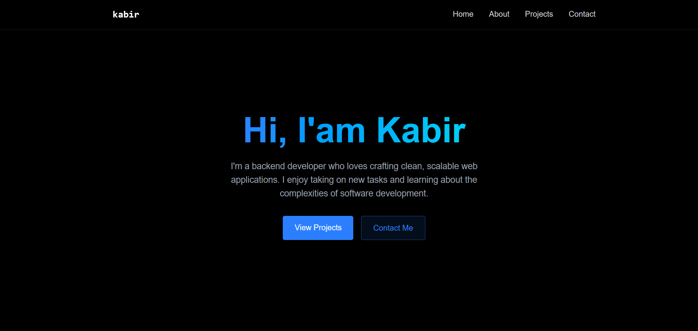

# 🚀 My Portfolio - Modern React Portfolio

[](https://my-portfolio-lake-six-87.vercel.app/)
[](https://my-portfolio-lake-six-87.vercel.app/)
[](https://github.com/kabirhiking/Beutiful-PORTFOLIO)
[](https://github.com/kabirhiking/Beutiful-PORTFOLIO/actions)

A modern, responsive personal portfolio built with React, Vite, and TailwindCSS. Features Docker containerization and deployed on Vercel.

**🔗 [View Live Portfolio](https://my-portfolio-lake-six-87.vercel.app/)**



---

## ✨ Features

- 🎨 **Modern UI** - Glass-morphism design with smooth animations
- 📱 **Responsive** - Works on all devices
- ⚡ **Fast** - Built with Vite for optimal performance
- 🐳 **Dockerized** - Ready for any deployment platform
- 🚀 **CI/CD** - Automated deployment with GitHub Actions
- 📧 **Contact Form** - EmailJS integration

---

## 🛠️ Tech Stack

**Frontend:** React, Vite, TailwindCSS, JavaScript  
**DevOps:** Docker, GitHub Actions, Nginx  
**Deployment:** Vercel, GitHub Pages, Container Registry  

---

## 🚀 Quick Start

### Local Development
```bash
git clone https://github.com/kabirhiking/Beutiful-PORTFOLIO.git
cd Beutiful-PORTFOLIO
npm install
npm run dev
```

### Docker
```bash
docker build -t portfolio-app .
docker run -d -p 3000:80 --name portfolio-app portfolio-app
```

### Deploy on Vercel
1. Fork this repository
2. Connect your GitHub account to [Vercel](https://vercel.com)
3. Import your forked repository
4. Set Environment Variables (if using EmailJS):
   - `VITE_SERVICE_ID`
   - `VITE_TEMPLATE_ID`
   - `VITE_PUBLIC_KEY`
5. Deploy! 🚀

---

## 📦 Scripts

```bash
npm run dev          # Development server
npm run build        # Production build
npm run deploy       # Deploy to GitHub Pages
npm run build:docker # Build for Docker
```

---

## 🐳 Docker Commands

```bash
# Build & Run
docker build -t portfolio-app .
docker run -d -p 3000:80 --name portfolio-app portfolio-app

# Manage
docker stop portfolio-app
docker logs portfolio-app
```

---

## 📁 Project Structure

```
├── src/
│   ├── components/
│   │   ├── sections/        # Home, About, Projects, Contact
│   │   ├── Navbar.jsx
│   │   └── LoadingScreen.jsx
│   └── App.jsx
├── Dockerfile               # Multi-stage build
├── .github/workflows/       # CI/CD pipeline
└── package.json
```

---

## 🚀 Deployment

**Automatic:** Push to `main` branch → GitHub Actions builds & deploys  
**Manual:** `npm run deploy` for direct GitHub Pages deployment  
**Docker:** Available in GitHub Container Registry

---

## 🔧 Customization

- Edit `src/components/sections/` for content
- Modify TailwindCSS classes for styling  
- Update `vite.config.js` for build settings

---

## 🤝 Contributing

1. Fork the repository
2. Create feature branch
3. Make changes
4. Submit pull request

---

## 📞 Contact

**GitHub:** [@kabirhiking](https://github.com/kabirhiking)  
**Live Portfolio:** [my-portfolio-lake-six-87.vercel.app](https://my-portfolio-lake-six-87.vercel.app/)

---

⭐ **Star this repo if it helped you!**

Made with ❤️ by [Kabir Hiking](https://github.com/kabirhiking)

### **Frontend**


### **DevOps & Deployment**


---

## 🚀 Quick Start

### **Method 1: Traditional Development**

```bash
# Clone the repository
git clone https://github.com/kabirhiking/Beutiful-PORTFOLIO.git
cd Beutiful-PORTFOLIO

# Install dependencies
npm install

# Start development server
npm run dev
```

Visit `http://localhost:5173` 🌐

### **Method 2: Docker Development**

```bash
# Build Docker image
docker build -t portfolio-app .

# Run container
docker run -d -p 3000:80 --name portfolio-container portfolio-app
```

Visit `http://localhost:3000` 🐳

---

## 📦 Available Scripts

```bash
# Development
npm run dev              # Start development server
npm run build           # Build for production
npm run preview         # Preview production build

# Deployment
npm run build:docker    # Build for Docker deployment
npm run build:pages     # Build for GitHub Pages
npm run deploy          # Deploy to GitHub Pages

# Quality
npm run lint            # Run ESLint
```

---

## 🐳 Docker Commands

### **Local Development**
```bash
# Build image
docker build -t portfolio-app .

# Run container
docker run -d -p 3000:80 --name portfolio-app portfolio-app

# View logs
docker logs portfolio-app

# Stop container
docker stop portfolio-app
```

### **Production Deployment**
```bash
# Build for different targets
docker build --build-arg BUILD_BASE_PATH="/" -t portfolio-app .           # Docker
docker build --build-arg BUILD_BASE_PATH="/Beutiful-PORTFOLIO/" -t portfolio-app .  # GitHub Pages
```

---

## 🏗️ Project Structure

```
Beutiful-PORTFOLIO/
├── 📁 .github/workflows/
│   └── 📄 deploy.yml           # CI/CD pipeline
├── 📁 public/
│   └── 📄 vite.svg
├── 📁 src/
│   ├── 📁 components/
│   │   ├── 📄 LoadingScreen.jsx
│   │   ├── 📄 MobileMenu.jsx
│   │   ├── 📄 Navbar.jsx
│   │   ├── 📄 RevealOnScroll.jsx
│   │   └── 📁 sections/
│   │       ├── 📄 About.jsx
│   │       ├── 📄 Contact.jsx
│   │       ├── 📄 Home.jsx
│   │       └── 📄 Projects.jsx
│   ├── 📁 assets/
│   ├── 📄 App.jsx
│   ├── 📄 App.css
│   ├── 📄 index.css
│   └── 📄 main.jsx
├── 🐳 Dockerfile              # Multi-stage Docker build
├── 📄 .dockerignore
├── 📄 docker-compose.yml      # Optional orchestration
├── 📄 package.json
├── 📄 vite.config.js
├── 📄 eslint.config.js
├── 📄 DOCKER_SETUP_GUIDE.md  # Comprehensive Docker guide
├── 📄 DEPLOYMENT_GUIDE.md    # Deployment documentation
└── 📄 README.md
```

---

## 🔄 CI/CD Pipeline

This project features a complete **GitHub Actions** workflow that:

1. **🔨 Builds** Docker image with correct base path
2. **📦 Extracts** static files from container
3. **🚀 Deploys** to GitHub Pages automatically
4. **📋 Stores** Docker images in GitHub Container Registry

**Trigger:** Every push to `main` branch automatically deploys! ✨

---

## 🌐 Deployment Options

### **1. GitHub Pages (Current)**
- ✅ **Free hosting**
- ✅ **Custom domain support**
- ✅ **HTTPS enabled**
- ✅ **CDN optimized**

### **2. Docker Deployment**
```bash
# Pull from registry
docker pull ghcr.io/kabirhiking/portfolio-app:latest

# Run anywhere
docker run -d -p 80:80 ghcr.io/kabirhiking/portfolio-app:latest

---


## 🔧 Environment Configuration

### **Development**
```bash
VITE_API_URL=http://localhost:3001
VITE_ENVIRONMENT=development
```

### **Production**
```bash
VITE_API_URL=https://api.yourdomain.com
VITE_ENVIRONMENT=production
```

---

## 📊 Project Stats


---

## 📝 License

This project is licensed under the **MIT License** - see the [LICENSE](LICENSE) file for details.

---

## 🙏 Acknowledgments

- **React Team** - For the amazing React library
- **Vite Team** - For the blazing fast build tool
- **Tailwind Labs** - For the utility-first CSS framework
- **Docker Inc** - For containerization technology
- **GitHub** - For Actions and Pages hosting

---

## 📬 Contact

**Kabir Hiking** - [@kabirhiking](https://github.com/kabirhiking)

**Project Link:** [https://github.com/kabirhiking/Beutiful-PORTFOLIO](https://github.com/kabirhiking/Beutiful-PORTFOLIO)

**Live Portfolio:** [https://my-portfolio-lake-six-87.vercel.app/](https://my-portfolio-lake-six-87.vercel.app/)

---

<div align="center">

**⭐ Star this repository if it helped you!**

Made with ❤️ and ☕ by [Kabir Hiking](https://github.com/kabirhiking)

</div>


